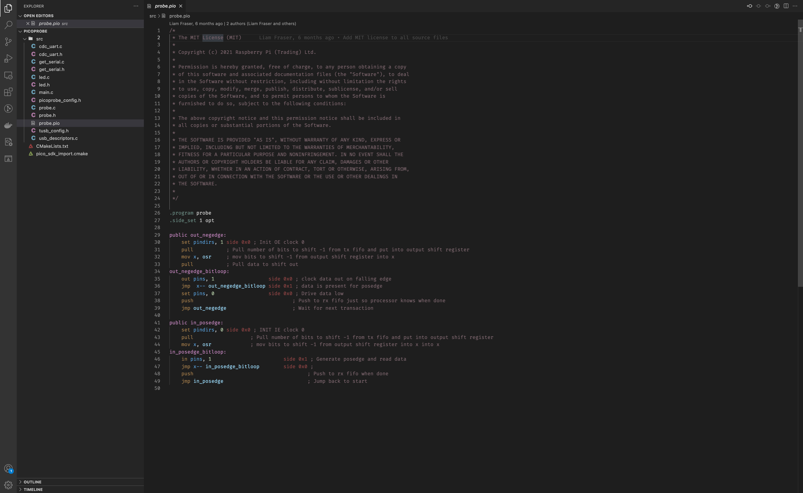

# PIO assembly syntax highlighting

PIO ASM extension add syntax highlighting to .pio files written using Raspberry Pi Pico PIO assembly language.
Forked from [Chris Hockuba](https://gitlab.com/khockuba/vscode-syntax-pioasm), including a PR by [Rens Hijdra](https://gitlab.com/khockuba/vscode-syntax-pioasm/-/merge_requests/1).

## Features

By using this extension you will get colored directives, labels, instructions, arguments and comments.

## Release Notes
### 1.0.0

Initial release
